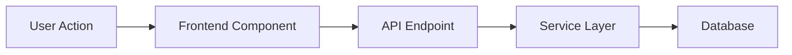

# Executive Summary Generator

Create a concise, non-technical executive/product team summary from one or more implementation plans. Transform detailed technical plans into accessible documentation focused on user stories, workflows, UI requirements, and service integrations without implementation details.

## Variables

ARGUMENTS: $ARGUMENTS
OUTPUT_DIRECTORY: `/docs/summaries/`

## Mode Selection

Parse the ARGUMENTS to extract:
- MODE: Extract from `--mode=<value>` flag (default: "full")
  - `task-list`: Concise task list with user stories and plan links
  - `phase-overview`: Phase-based overview with UI, APIs, routes, and acceptance criteria (no diagrams)
  - `phase-diagrams`: Phase-based overview with dataflow diagrams
  - `full`: Complete executive summary with all sections and diagrams
- NO_REFS: Extract `--no-refs` flag (boolean, default: false)
  - When true, completely omit all plan reference links from the output
  - Only applies to task-list mode
- PLAN_FILES: All remaining arguments after removing the --mode and --no-refs flags

## Instructions

Read the specified plan file(s) from the PLAN_FILES variable and create a summary based on the MODE:

### MODE: task-list

Create a concise story list with the following structure:

**Format**:
```markdown
# Stories for [Project Name]

## Story 1: [Story Title]
**Description**: [First sentence: what needs to be done with user-focused context]. [Second sentence: where/how the feature will work or be accessed]

**Plan Reference** *(optional, omit if --no-refs flag is present)*: [Link to detailed section in original plan, e.g., `docs/plans/file.md#phase-1-foundation`]

---

## Story 2: [Story Title]
**Description**: [Another two-sentence description]

---
```

**Note**: When `--no-refs` flag is present, omit the "Plan Reference" line entirely for all stories.


**Requirements**:
- Extract all major tasks from the plan(s) and present them as stories
- Each story gets ONE description with two sentences:
  1. First sentence: What needs to be done with user story elements naturally woven in (e.g., "Build admin dashboard so admins can manage data")
  2. Second sentence: Where the feature will live and/or how it will work (e.g., "The dashboard will be accessible from the admin portal with search and filtering capabilities")
- Plan Reference handling:
  - If NO_REFS flag is true: Completely omit all plan references
  - If NO_REFS flag is false (default): Include plan references when there's a clear, specific section to link to; omit if the story is general or doesn't map to a specific plan section
  - Use GitHub anchor format when included (e.g., `#phase-1-foundation`)
- Keep it extremely concise - just the essentials
- No separate user story section, no diagrams, no detailed acceptance criteria, no code

---

### MODE: phase-overview

Create a phase-based overview with no diagrams:

**Structure**:
```markdown
# [Project Name] - Phase Overview

## Phase 1: [Phase Name]

**Brief Description**: [2-3 sentences about what this phase delivers]

**UI Pages/Screens**:
- [Page/Screen 1]: [Purpose]
- [Page/Screen 2]: [Purpose]

**External APIs**:
- [Service/API Name]: [What it's used for]

**Key Existing Shared Data**:
- **Entities**: [List of existing types/entities being reused]
- **Functions**: [List of existing utility functions being reused]
- **Types**: [List of existing TypeScript types/interfaces being reused]

**New Routes Created**:
- `[HTTP METHOD] /path`: [Purpose]
- `[HTTP METHOD] /path`: [Purpose]

**Acceptance Criteria**:
- [ ] [Criterion 1]
- [ ] [Criterion 2]
- [ ] [Criterion 3]

**Plan Reference**: [Link to phase in original plan]

---

## Phase 2: [Phase Name]
...
```

**Requirements**:
- All content inlined into each phase section
- NO code snippets
- NO diagrams
- Focus on WHAT is being built, not HOW
- Identify and list existing shared resources to promote code reuse
- Keep descriptions brief and business-focused

---

### MODE: phase-diagrams

Same structure as `phase-overview` but add dataflow diagrams for each phase:

**Additional Content per Phase**:
```markdown
**Data Flow**:

```

**Requirements**:
- Include Mermaid dataflow diagrams showing how data moves through the system in each phase
- Use `graph LR` or `flowchart TD` for dataflow
- Show: User → Frontend → API → Services → External APIs/Database
- Keep diagrams simple and focused on data movement
- Otherwise identical to phase-overview mode

---

### MODE: full

Complete executive summary with all sections (current default behavior):

**Required Sections**:

1. **Executive Overview**
   - One-paragraph project summary
   - Business value and objectives
   - Key stakeholders impacted
   - Overall scope and scale of the initiative

2. **Phases & Delivery Schedule**
   - Break down the work into logical phases/milestones
   - For each phase include:
     - **Phase name and PR complexity** (Low, Medium, High)
     - **Key deliverables** (features/capabilities)
     - **Business value** delivered in this phase
     - **Dependencies** on previous phases or external factors
     - **User-facing changes** in this phase
   - Use Mermaid diagram showing phase relationships and dependencies (flowchart or graph)
   - Show incremental value delivery
   - Highlight which phases can be released independently
   - DO NOT include timeline estimates, days, or duration - only complexity

3. **User Stories**
   - Who will use this feature
   - What they want to accomplish
   - Why it matters
   - Format: "As a [role], I want to [action] so that [benefit]"
   - Group by phase if phases are defined

4. **User Experience & Workflows**
   - High-level user journeys
   - Key interaction points
   - Mermaid diagrams showing:
     - User workflows (flowcharts)
     - System interactions (sequence diagrams)
     - State transitions where relevant
   - Screen/page flows

5. **System Components**
   - **UI Pages/Screens**: List all new/modified pages
   - **Modules/Services**: High-level system components
   - **External Services**: Third-party integrations and APIs
   - **Data Flow**: Simplified data movement diagram

6. **Technical Touchpoints** (Non-Technical)
   - External APIs/services we'll integrate with
   - Backend endpoints (purpose only, not implementation)
   - Key data entities
   - Security/compliance considerations

7. **Success Metrics**
   - How we'll measure success
   - Key performance indicators
   - User adoption goals

8. **Suggested GitHub Issues**
   - Create a structured list of GitHub issues organized by phase
   - For each issue include:
     - **Issue Title**: Clear, actionable title (e.g., "Build Admin Dashboard UI")
     - **Phase Reference**: Which phase this belongs to
     - **Description**: Brief 2-3 sentence description of the work
     - **Acceptance Criteria**: Bulleted list of what "done" looks like
     - **Plan Reference**: Link to specific section in original plan file (e.g., `docs/plans/PLAN#phase-1`)
     - **Suggested Labels**: e.g., `feature`, `backend`, `frontend`, `phase-1`
     - **Priority**: High/Medium/Low based on dependencies
     - **PR Complexity**: Low/Medium/High based on technical scope and risk
   - Group issues by phase for clarity
   - Include dependencies between issues where relevant
   - Format in a way that can be easily copied to GitHub issue creation

### Formatting Guidelines

- **NO CODE**: Absolutely no code snippets, function names, or technical implementation
- **Use Mermaid**: Create visual diagrams for workflows and system architecture
- **Keep Concise**: Aim for 2-3 pages maximum
- **Use Plain Language**: Avoid technical jargon; explain in business terms
- **Visual First**: Prefer diagrams over text where possible
- **Bullet Points**: Use lists for readability

### GitHub Issue Format Example

```markdown
## Phase 1: Foundation

### Issue 1: Build Multi-Customer Dashboard
**Phase**: Phase 1 - Foundation
**Priority**: High
**PR Complexity**: High
**Labels**: `feature`, `frontend`, `admin`, `phase-1`
**Plan Reference**: [Phase 1 - Foundation](docs/plans/PLAN.md)

**Description**:
Create a unified dashboard that displays all customer accounts across the platform. This will allow admins to view, search, and filter multiple customers in a single interface.

**Acceptance Criteria**:
- [ ] Display table of all customer cards with key information (customer name, ID, status, balance)
- [ ] Implement search functionality by customer name, email, or ID
- [ ] Add filters for card status (active, frozen, closed)
- [ ] Include pagination for large datasets
- [ ] Add export functionality for filtered results
- [ ] Show environment indicator (sandbox/production)

**Dependencies**: None

---

### Issue 2: Implement Backend API for Customer Data Aggregation
...
```

### Excluded Content

- Do NOT include code examples or pseudo-code
- Do NOT include file paths or line numbers
- Do NOT include implementation steps
- Do NOT include testing strategies (unless user-facing)
- Do NOT include database schemas or API specifications

## Workflow

1. **Parse Arguments** - Extract MODE, NO_REFS flag, and PLAN_FILES from ARGUMENTS
2. **Read Plans** - Read all specified plan files from PLAN_FILES
3. **Extract Business Context** - Identify core business value, user needs, and objectives
4. **Execute Mode-Specific Generation**:

   **For task-list**:
   - Extract all major tasks from the plan(s) and present as stories
   - Create two-sentence descriptions per story:
     - Sentence 1: What needs to be done (with user-focused context)
     - Sentence 2: Where/how the feature will work
   - If NO_REFS is false: optionally include plan reference links where specific sections exist
   - If NO_REFS is true: omit all plan references
   - Generate concise story list

   **For phase-overview**:
   - Extract all phases from the plan(s)
   - For each phase, identify: UI pages, external APIs, existing shared code, new routes, acceptance criteria
   - Generate phase overview document

   **For phase-diagrams**:
   - Same as phase-overview
   - Additionally create Mermaid dataflow diagrams for each phase

   **For full**:
   - Extract phases and delivery schedule
   - Map user journeys and create user stories
   - Identify all components (UI, modules, external services)
   - Generate GitHub issues with plan references
   - Create comprehensive Mermaid diagrams (phases, workflows, architecture)
   - Compose complete executive summary

5. **Generate Filename** - Create descriptive kebab-case filename based on mode:
   - task-list: `<project>-story-list.md`
   - phase-overview: `<project>-phase-overview.md`
   - phase-diagrams: `<project>-phase-overview-with-diagrams.md`
   - full: `<project>-executive-summary.md`

6. **Save & Report** - Write to `OUTPUT_DIRECTORY/<filename>.md`

## Mermaid Diagram Examples

Use these diagram types:

- **Phase Dependencies**: `flowchart LR` or `graph TD` showing phase relationships and dependencies
- **User Workflow**: `flowchart TD` for step-by-step user journeys
- **System Interaction**: `sequenceDiagram` for cross-system communication
- **Architecture**: `graph LR` for component relationships
- **State Machines**: `stateDiagram-v2` for status/state flows

Note: Do NOT use Gantt charts or any time-based diagrams

## Report

After creating the summary, provide a report based on the MODE:

**For task-list**:
```
Story List Generated

Mode: task-list
File: OUTPUT_DIRECTORY/<filename>.md
Source Plans: <list of plan files read>
Stories: <count>
```

**For phase-overview**:
```
Phase Overview Generated

Mode: phase-overview
File: OUTPUT_DIRECTORY/<filename>.md
Source Plans: <list of plan files read>
Phases: <count>
Key Areas Covered:
- UI Pages/Screens
- External APIs
- Existing Shared Code
- New Routes
- Acceptance Criteria
```

**For phase-diagrams**:
```
Phase Overview with Diagrams Generated

Mode: phase-diagrams
File: OUTPUT_DIRECTORY/<filename>.md
Source Plans: <list of plan files read>
Phases: <count>
Diagrams: <count>
Key Areas Covered:
- UI Pages/Screens
- External APIs
- Existing Shared Code
- New Routes
- Acceptance Criteria
- Data Flow Diagrams
```

**For full**:
```
Executive Summary Generated

Mode: full
File: OUTPUT_DIRECTORY/<filename>.md
Source Plans: <list of plan files read>
Phases: <count>
Key Deliverables:
- <deliverable 1>
- <deliverable 2>
- <deliverable 3>

User Stories: <count>
GitHub Issues: <count>
Diagrams: <count>
Pages: <estimated page count>
```

## Usage Examples

```bash
# Story list mode - concise stories with two-sentence descriptions (plan links optional)
/executive-summary --mode=task-list docs/plans/bridge-cards-admin-dashboard-v1.md

# Story list mode WITHOUT plan references
/executive-summary --mode=task-list --no-refs docs/plans/bridge-cards-admin-dashboard-v1.md

# Phase overview mode - detailed phases without diagrams
/executive-summary --mode=phase-overview docs/plans/bridge-cards-admin-dashboard-v1.md

# Phase overview with dataflow diagrams
/executive-summary --mode=phase-diagrams docs/plans/bridge-cards-admin-dashboard-v1.md

# Full executive summary (default)
/executive-summary --mode=full docs/plans/bridge-cards-admin-dashboard-v1.md
/executive-summary docs/plans/bridge-cards-admin-dashboard-v1.md  # --mode=full is default

# Multiple plans with specific mode
/executive-summary --mode=phase-overview docs/plans/bridge-cards-admin-v1.md docs/plans/bridge-cards-production-api-integration-v2.md

# All plans in directory with story list mode (no references)
/executive-summary --mode=task-list --no-refs docs/plans/*.md
```

## Notes

### General
- If PLAN_FILES is empty or invalid, ask the user to specify plan file(s)
- If MODE is not specified or invalid, default to "full"
- For multiple plans, create a unified summary showing how they work together
- Extract phases from the implementation plan - most plans have a "Phases" or similar section
- If no phases are defined in the plan, create logical groupings based on functionality
- Focus on "what" and "why", not "how"
- Think from the perspective of: product managers, executives, stakeholders who need to understand scope and impact without technical details

### Mode-Specific Notes

**task-list**:
- Keep it extremely concise - this is for quick reference
- One story per major deliverable or feature
- Each story has ONE description field with exactly two sentences:
  - First sentence: What needs to be done with user-focused context naturally woven in
  - Second sentence: Where the feature will live and/or how it will work (e.g., location in app, user interaction, key capabilities)
- No separate user story sections - keep it simple
- Plan references behavior:
  - If `--no-refs` flag is present: Omit all plan references completely
  - If `--no-refs` flag is NOT present: Include plan references only when there's a clear, specific section to link to
  - When included, plan references must use GitHub anchor format (e.g., `#phase-1-foundation`)

**phase-overview & phase-diagrams**:
- Focus on identifying existing shared code to maximize reuse
- Search the codebase for existing entities, types, and utility functions that can be leveraged
- New routes should include HTTP method and purpose
- Acceptance criteria should be testable and specific
- For phase-diagrams mode, dataflow diagrams should be simple and focused on data movement only

**full**:
- Phases should show incremental value delivery, not technical implementation order
- GitHub issues should be actionable and ready to create - include all necessary context
- Issue plan references should link to specific sections using GitHub markdown anchor links (e.g., `#phase-1-foundation`)
- Break down large phases into multiple issues if they represent distinct deliverables
- Consider creating separate issues for frontend, backend, and testing when appropriate
- PR Complexity guidelines: Low = simple changes, single file; Medium = multiple files, moderate risk; High = significant changes, cross-cutting concerns
